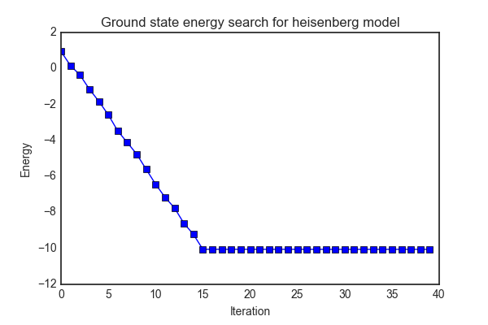
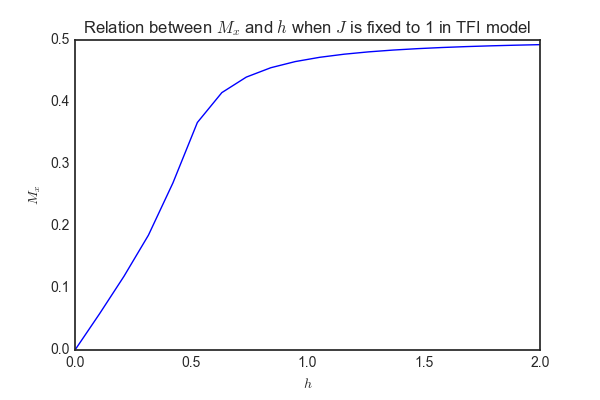
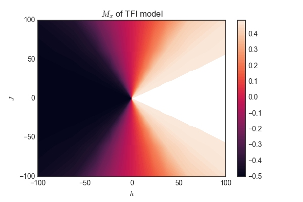

# SimpleMPS
This is a simplest demo of Matrix product state (MPS) based density matrix renormalization group (DMRG) with detailed comments, particularly suitable for new-learners to quickly get the idea of how MPS works at code level. For sophisticated and production-ready MPS packages, I recommend [pytenet](https://github.com/cmendl/pytenet) and [quimb](https://github.com/jcmgray/quimb).

---
# What is SimpleMPS
Density matrix renormalization group (DMRG) is a powerful method to simulate one-dimensional strongly correlated quantum systems. During recent years, combining DMRG with matrix product state (MPS) has allowed further understanding of the DMRG method. `SimpleMPS` aims to provide a demo for MPS based DMRG to solve the [Heisenberg model](https://en.wikipedia.org/wiki/Heisenberg_model_(quantum)). The ground state of the Heisenberg model could be obtained iteratively (see the image below, $h=1$, $J=J_z=1$, 20 sites). 

The phase transition of [transverse field Ising (TFI) model](https://en.wikipedia.org/wiki/Ising_model#One-dimensional_solution_with_transverse_field) is also provided as a further example (see the image below, 20 sites. Analytical result is based on periodic boundary condition).

The implementation is largely inspired by [The density-matrix renormalization group in the age of matrix product states](https://arxiv.org/abs/1008.3477v2). Understanding the first 6 parts of the article is crucial to understanding the code. 

# Files
* `./SimpleMPS/mps.py` Implements the MPS based DMRG method
* `./SimpleMPS/paulimat.py` Defines the Pauli matrices used in Heiserberg and Ising model
* `./SimpleMPS/heisenberg.py` Defines the hamiltonian and matrix product operator of the Heisenberg model then searches for the ground state
* `./SimpleMPS/ising.py` Defines the hamiltonian and matrix product operator of the transverse field Ising model and then studies the phase diagram and phase transition.
* `./Notebook/analyze_ising.ipynb` Analyzes the result calculated by `./SimpleMPS/ising.py`

# How to use
* `python heisenberg.py` to see the energy of the system during each iteration. There are 3 parameters hard-coded in `heisenberg.py`: 
  * `SITE_NUM` which is the number of sites in the model.
  * `MAX_BOND_ORDER` which is the maximum order of the bond degree in matrix product state. The higher bond order, the higher accuracy and computational cost.
  * `ERROR_THRESHOLD` which is the threshold for error when compressing matrix product state by SVD. The lower the threshold, the higher accuracy and computational cost.
  * One and only one of `MAX_BOND_ORDER` or `ERROR_THRESHOLD` should be provided.
* `python ising.py` to see the relation between $M_x$ and $h$ when $J$ is fixed to 1 and $h$ varies from 0 to 2. The parameters in `ising.py` is the same as those in `heisenberg.py`. If you want to calculate the phase diagram, call `calc_phase_diagram` in the file, which typically takes hours.
* Modify the codes to explore DMRG and MPS!
